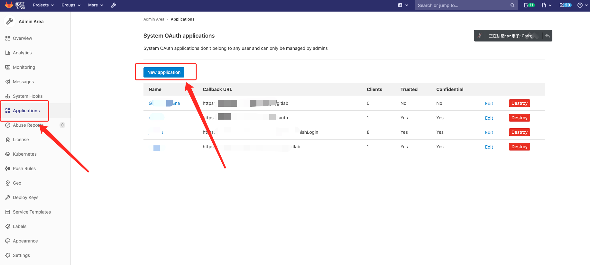
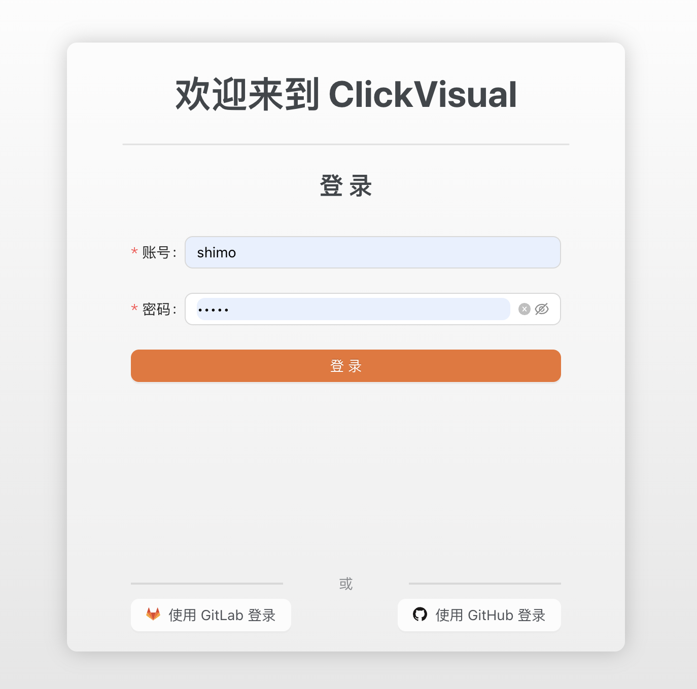

# GitLab Oauth2

To enable GitLab OAuth2, you need to register the application in GitLab. GitLab will generate a client ID and secret for you to use.

## 1. Create GitLab key
This example assumes your privately deployed GitLab domain name is mygitlab.com,and com，and ClickVisual domain name is clickvisual.example.com.Meanwhile,you can find guide from the official GitLab documentation.


To use administrator role account,access https://mygitlab.com/admin/applications ,select 'Application' in the left menu, then click 'New Application' in the right panel.

image.png

Fill in the name of the application you need to create (such as clickvisual) and use the redirect URI https://clickvisual.example.com/api/admin/login/gitlab (if the deployed ClickVisual does not have HTTPS enabled, you can also use IP:Port to instead).

image.png

After submitting the create Application form, the returned page displays the Application ID and Secret of the currently created clickvisual Application, take care to save the Application ID and Secret, which will be configured later in clickvisual.

image.png

## 2.Enable GitLab Oauth2 
   Go through the demo:
```
[app]
rootURL = "https://clickvisual.example.com/"　　　　　　　　　　　# your clickvisual domain

[[auth.tps]]
typ = "gitlab"　　　　　　　　　　　　　　　　　　　　　　　　 # need to be gitlab here
enable = true
allowSignUp = true
clientId = "clickvisual_APPLICATION_ID"　　　　　　　　　　　　　 #Use the Application ID got above 
clientSecret = "clickvisual_SECRET"　　　　　　　　　　　　　　　　#Use the Secret got above 
scopes = ["api"]　　　　　　　　　　　　　　　　　　　　　　　# consistent with the configuration above, just fill in ["api"]
authUrl = "https://mygitlab.com/oauth/authorize"　　　　# Replace here with your GitLab domain name
tokenUrl = "https://mygitlab.com/oauth/token"　　　　　 # Replace here with your GitLab domain name
apiUrl = "https://mygitlab.com/api/v4"　　　　　　　　　　# Replace here with your GitLab domain name
allowedDomains = []
teamIds = []
allowedOrganizations = []
```
Restart ClickVisual service,then access https://clickvisual.example.com/user/login/ ,click 『Sign in with  GitLab』,then go to the GitLab login page to complete the ClickVisual authorization login configuration.

image.png